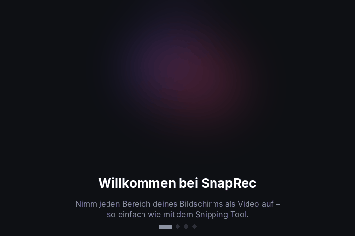
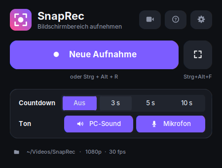
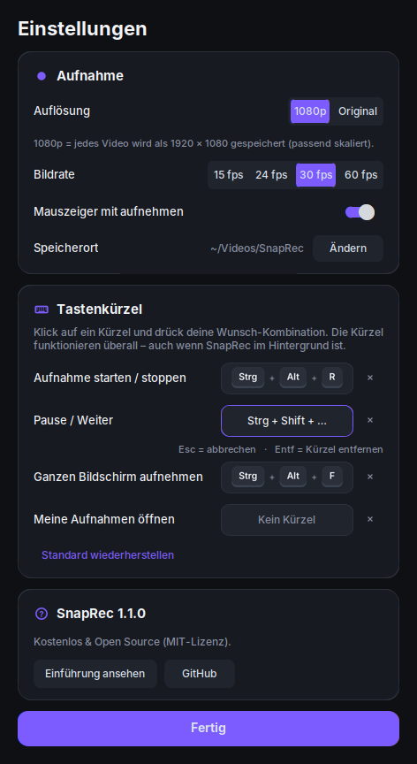
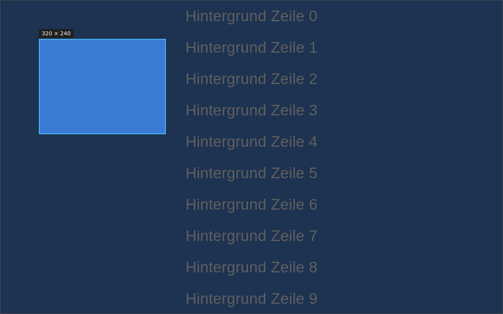
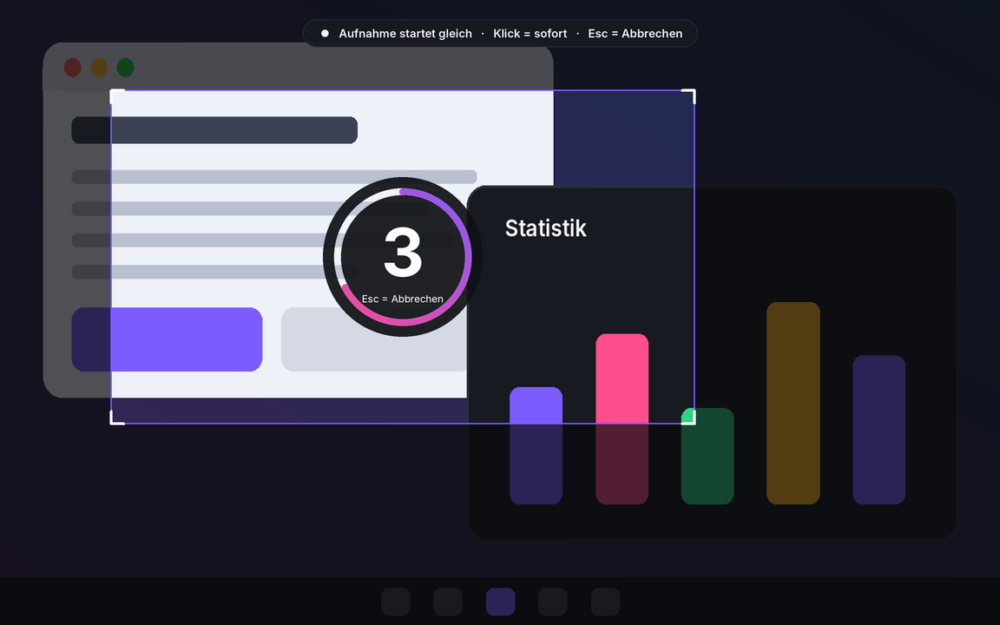
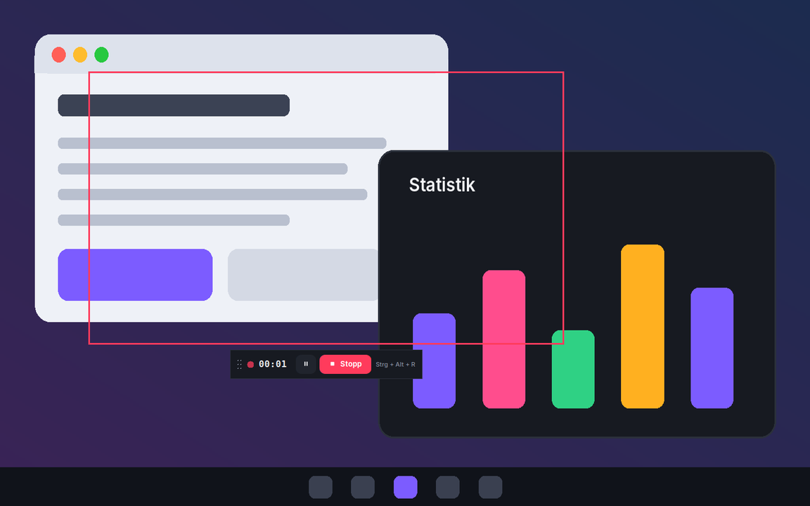
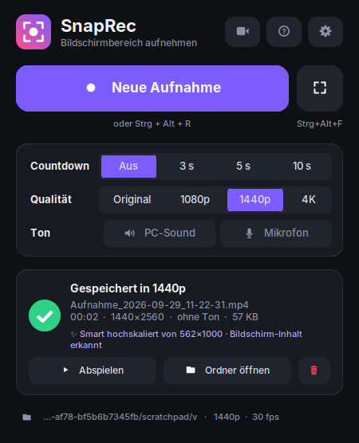

<div align="center">


# SnapRec

**Bildschirmbereich aufnehmen – so einfach wie mit dem Snipping Tool.**<br>
Bildschirm wird grau · Bereich aufziehen · Countdown · fertiges MP4.

[](https://github.com/anonym239/SnapRec/releases/latest/download/SnapRec.exe)

[](https://github.com/anonym239/SnapRec/releases/latest)
[](https://github.com/anonym239/SnapRec/actions)
[](LICENSE)


<br>



</div>

---

## ✨ Was SnapRec kann

<table>
<tr>
<td width="33%" valign="top">

### 🖱️ Bereich aufziehen
Der Bildschirm wird grau abgedunkelt, dein Bereich leuchtet hell auf – mit Live-Größe in Pixeln. Doppelklick nimmt den ganzen Monitor.

</td>
<td width="33%" valign="top">

### ⏱️ Countdown
Aus, **3**, 5 oder 10 Sekunden – mit animiertem Ring direkt über deinem Bereich. Klick startet sofort, Esc bricht ab.

</td>
<td width="33%" valign="top">

### 🎬 Sofort ein MP4
H.264-Video, das überall läuft: WhatsApp, Discord, PowerPoint, Browser. Mit Pause & Stopp.

</td>
</tr>
<tr>
<td valign="top">

### ⌨️ Eigene Tastenkürzel
Leg deine Wunsch-Kombinationen fest – z. B. **Strg + Alt + R** zum Starten/Stoppen. Funktioniert auch im Hintergrund.

</td>
<td valign="top">

### 👻 Unsichtbare Steuerung
Rahmen und Leiste landen nicht im Video – auch nicht bei Vollbild (Windows 10 2004+ / 11).

</td>
<td valign="top">

### 🖥️ Durchdacht
Mehrere Monitore, Mauszeiger optional, 15–60 fps, Speicherort frei wählbar, animierte Einführung.

</td>
</tr>
</table>

## 📸 So sieht's aus

<table>
<tr>
<td align="center"><br><sub>Hauptfenster</sub></td>
<td align="center"><br><sub>Einstellungen & eigene Tastenkürzel</sub></td>
</tr>
<tr>
<td align="center"><br><sub>① Bereich aufziehen</sub></td>
<td align="center"><br><sub>② Countdown</sub></td>
</tr>
<tr>
<td align="center"><br><sub>③ Aufnahme mit Pause & Stopp</sub></td>
<td align="center"><br><sub>④ Gespeichert – abspielen oder Ordner öffnen</sub></td>
</tr>
</table>

## 🚀 Loslegen

### Windows – fertiges Programm
1. **[SnapRec.exe herunterladen](https://github.com/anonym239/SnapRec/releases/latest/download/SnapRec.exe)**
2. Doppelklick – fertig. Keine Installation, kein Python nötig.

> [!NOTE]
> Beim ersten Start meldet Windows evtl. *„Der Computer wurde durch Windows geschützt“*. Das ist bei neuen Programmen ohne gekaufte Code-Signatur normal: **Weitere Informationen → Trotzdem ausführen**.

### Mit Python (Windows, Linux, macOS)
```sh
git clone https://github.com/anonym239/SnapRec.git
cd SnapRec
```
- **Windows:** `start_windows.bat` doppelklicken
- **Linux / macOS:** `./start.sh`

Beim ersten Start werden die Pakete automatisch installiert. Oder manuell:
`pip install -r requirements.txt` und `python -m snaprec`.

> [!TIP]
> **Linux:** Tkinter wird benötigt (`sudo apt install python3-tk`) und eine X11-Sitzung – unter Wayland bitte „… auf Xorg“ wählen.
> **macOS:** Dem Terminal die Rechte *Bildschirmaufnahme* und *Bedienungshilfen* (für Tastenkürzel) geben.

## ⌨️ Bedienung

| Aktion | Standard | Anpassbar |
|---|---|:---:|
| Aufnahme starten / stoppen | <kbd>Strg</kbd> + <kbd>Alt</kbd> + <kbd>R</kbd> | ✅ |
| Pause / Weiter | <kbd>Strg</kbd> + <kbd>Alt</kbd> + <kbd>P</kbd> | ✅ |
| Ganzen Bildschirm aufnehmen | <kbd>Strg</kbd> + <kbd>Alt</kbd> + <kbd>F</kbd> | ✅ |
| Neue Aufnahme (im Fenster) | <kbd>Strg</kbd> + <kbd>N</kbd> | |
| Einführung anzeigen | <kbd>F1</kbd> | |
| Ganzer Monitor (im grauen Bildschirm) | Doppelklick oder <kbd>Enter</kbd> | |
| Auswahl / Countdown abbrechen | <kbd>Esc</kbd> oder Rechtsklick | |

**Eigene Tastenkürzel festlegen:** ⚙️ *Einstellungen → Tastenkürzel* → auf ein Kürzel klicken → Wunsch-Kombination drücken.
Erlaubt sind <kbd>Strg</kbd>, <kbd>Alt</kbd>, <kbd>Shift</kbd>, <kbd>Win</kbd> kombiniert mit Buchstaben, Zahlen, <kbd>F1</kbd>–<kbd>F24</kbd>, Pfeiltasten, <kbd>Druck</kbd>, <kbd>Pos1</kbd>, <kbd>Ende</kbd> u. v. m. – <kbd>Entf</kbd> entfernt ein Kürzel.
SnapRec warnt, wenn eine Kombination schon vergeben oder von einem anderen Programm belegt ist.

<details>
<summary><b>Kommandozeile</b></summary>

```text
SnapRec.exe [-c SEKUNDEN] [--fps FPS] [-o ORDNER] [--no-cursor] [-s | -f]

  -c, --countdown   Countdown in Sekunden (0 = keiner), z. B. -c 3
  --fps             Bilder pro Sekunde (Standard 30)
  -o, --output      Ordner für die Videos
  --no-cursor       Mauszeiger nicht aufnehmen
  -s, --start       sofort mit der Bereichsauswahl beginnen
  -f, --fullscreen  sofort den ganzen Bildschirm aufnehmen
```
(mit Python: `python -m snaprec …`)
</details>

## 🛠️ Für Entwickler

```text
snaprec/
├── app.py        Hauptfenster & Ablauf
├── overlay.py    grauer Bildschirm + animierter Countdown
├── recorder.py   Aufnahme-Thread (mss → ffmpeg/H.264)
├── widgets.py    Rahmen & Steuerleiste während der Aufnahme
├── settings.py   Einstellungen & Tastenkürzel-Editor
├── hotkeys.py    globale Kürzel (Windows: RegisterHotKey, sonst pynput)
├── intro.py      animierte Einführung (auch als GIF exportierbar)
└── theme.py      Farben, Logo, Icons, Animationen
```

```sh
pip install -r requirements.txt pytest
python -m pytest tests                 # Linux ohne Monitor: xvfb-run python -m pytest tests
python tools/make_assets.py            # Logo, Icon & Einführungs-GIF neu erzeugen
pyinstaller --onefile --windowed --name SnapRec --icon assets/icon.ico \
  --collect-all imageio_ffmpeg --collect-all customtkinter run.py
```

**Neuen Release veröffentlichen:** einfach `VERSION` in `snaprec/__init__.py` erhöhen und auf `main` pushen. GitHub Actions testet, baut die `SnapRec.exe` und legt den Release `v<VERSION>` automatisch an.

Gebaut mit [CustomTkinter](https://github.com/TomSchimansky/CustomTkinter), [mss](https://github.com/BoboTiG/python-mss), [imageio-ffmpeg](https://github.com/imageio/imageio-ffmpeg), [Pillow](https://python-pillow.org) und [pynput](https://github.com/moses-palmer/pynput).

## 📄 Lizenz

MIT – frei nutzbar, auch kommerziell. Siehe [LICENSE](LICENSE). Ideen, Issues und Pull Requests sind willkommen! 💜
