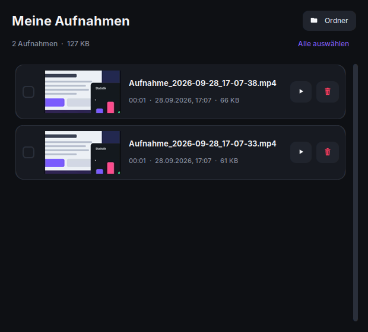

<div align="center">


# SnapRec

**Bildschirmbereich aufnehmen – so einfach wie mit dem Snipping Tool.**<br>
Bildschirm wird grau · Bereich aufziehen · Countdown · fertiges MP4 in 1080p – auf Wunsch mit Ton.

[](https://github.com/anonym239/SnapRec/releases/latest/download/SnapRec-Setup.exe)

[](https://github.com/anonym239/SnapRec/releases/latest)
[](https://github.com/anonym239/SnapRec/actions)
[](LICENSE)


<br>


</div>

---

## ✨ Was SnapRec kann

<table>
<tr>
<td width="33%" valign="top">

### 🖱️ Bereich aufziehen
Der Bildschirm wird grau abgedunkelt, dein Bereich leuchtet hell auf – mit Live-Größe in Pixeln. Doppelklick nimmt den ganzen Monitor.

</td>
<td width="33%" valign="top">

### ⏱️ Countdown
Aus, **3**, 5 oder 10 Sekunden – mit animiertem Ring direkt über deinem Bereich. Klick startet sofort, Esc bricht ab.

</td>
<td width="33%" valign="top">

### 🎬 Immer 1080p
Jedes Video wird in **1080p** (H.264-MP4) gespeichert: quer als 1920 × 1080, hochkant als 1080 × 1920 (TikTok/Shorts). Die Auswahl rastet auf 16:9 bzw. 9:16 ein (<kbd>Shift</kbd> = frei) – so gibt es keine schwarzen Ränder.

</td>
</tr>
<tr>
<td valign="top">

### 🔊 Ton in Top-Qualität
Auf Knopfdruck **PC-Sound** (was du hörst) und/oder **Mikrofon** – 48 kHz Stereo, AAC 320 kbit/s, synchron zum Bild, auch bei Pausen.

</td>
<td valign="top">

### 🗂️ Meine Aufnahmen
Alle Videos mit Vorschaubild, Dauer und Größe. Abspielen oder **löschen** (einzeln oder mehrere) – sicher in den Papierkorb.

</td>
<td valign="top">

### ⌨️ Eigene Tastenkürzel
Leg deine Wunsch-Kombinationen fest – z. B. **Strg + Alt + R** zum Starten/Stoppen. Funktioniert auch im Hintergrund.

</td>
</tr>
<tr>
<td valign="top">

### 👻 Unsichtbare Steuerung
Rahmen und Leiste landen nicht im Video – auch nicht bei Vollbild (Windows 10 2004+ / 11).

</td>
<td valign="top">

### ⏸️ Pause & Stopp
Schwebende Leiste mit Timer, frei verschiebbar – oder per Tastenkürzel.

</td>
<td valign="top">

### 🖥️ Durchdacht
Mehrere Monitore, Mauszeiger optional, 15–60 fps, Speicherort frei wählbar, animierte Einführung.

</td>
</tr>
</table>

## 📸 So sieht's aus

<table>
<tr>
<td align="center"><br><sub>Hauptfenster</sub></td>
<td align="center"><br><sub>Einstellungen & eigene Tastenkürzel</sub></td>
</tr>
<tr>
<td align="center"><br><sub>① Bereich aufziehen</sub></td>
<td align="center"><br><sub>② Countdown</sub></td>
</tr>
<tr>
<td align="center"><br><sub>③ Aufnahme mit Pause & Stopp</sub></td>
<td align="center"><br><sub>④ Gespeichert – 1080p mit Ton</sub></td>
</tr>
<tr>
<td align="center" colspan="2"><br><sub>Meine Aufnahmen – abspielen & löschen</sub></td>
</tr>
</table>

> [!TIP]
> **Tipp für maximale Schärfe:** 1080p kann nur so scharf sein wie der aufgenommene Bereich. Ein kleiner Bereich wird hochskaliert (SnapRec zeigt das beim Aufziehen an). Am schärfsten wird es mit **Vollbild** oder einem Bereich ab 1920 × 1080 Pixeln.

## 🚀 Loslegen

### Windows – Installationsprogramm (empfohlen)
1. **[SnapRec-Setup.exe herunterladen](https://github.com/anonym239/SnapRec/releases/latest/download/SnapRec-Setup.exe)**
2. Starten → *Weiter* → *Installieren*. Keine Admin-Rechte nötig, kein Python nötig.
3. SnapRec ist danach im Startmenü (auf Wunsch auch auf dem Desktop) und lässt sich über *Einstellungen → Apps* wieder entfernen.

**Ohne Installation:** [SnapRec-portable.zip](https://github.com/anonym239/SnapRec/releases/latest/download/SnapRec-portable.zip) herunterladen, entpacken, `SnapRec.exe` starten.

> [!NOTE]
> **„Herausgeber: Unbekannt“ / „Der Computer wurde durch Windows geschützt“:** Das zeigt Windows bei kostenlosen Programmen ohne gekauftes Code-Signing-Zertifikat. SnapRec ist Open Source – jeder kann den Code hier prüfen. **Weitere Informationen → Trotzdem ausführen.** In der Programmliste und in den Datei-Eigenschaften steht als Herausgeber **Alex Studios**.
>
> **Virenwarnung?** Programme, die mit Python/PyInstaller gebaut sind, werden von Virenscannern leider manchmal fälschlich gemeldet. SnapRec wird deshalb als normales Installationsprogramm gebaut und bei jedem Build automatisch mit Windows Defender geprüft. Falls trotzdem eine Warnung kommt: Die Datei kann bei Microsoft als [Fehlalarm gemeldet](https://www.microsoft.com/wdsi/filesubmission) werden.

### Mit Python (Windows, Linux, macOS)
```sh
git clone https://github.com/anonym239/SnapRec.git
cd SnapRec
```
- **Windows:** `start_windows.bat` doppelklicken
- **Linux / macOS:** `./start.sh`

Beim ersten Start werden die Pakete automatisch installiert. Oder manuell:
`pip install -r requirements.txt` und `python -m snaprec`.

> [!TIP]
> **Linux:** Tkinter wird benötigt (`sudo apt install python3-tk`) und eine X11-Sitzung – unter Wayland bitte „… auf Xorg“ wählen.
> **macOS:** Dem Terminal die Rechte *Bildschirmaufnahme* und *Bedienungshilfen* (für Tastenkürzel) geben.

## ⌨️ Bedienung

| Aktion | Standard | Anpassbar |
|---|---|:---:|
| Aufnahme starten / stoppen | <kbd>Strg</kbd> + <kbd>Alt</kbd> + <kbd>R</kbd> | ✅ |
| Pause / Weiter | <kbd>Strg</kbd> + <kbd>Alt</kbd> + <kbd>P</kbd> | ✅ |
| Ganzen Bildschirm aufnehmen | <kbd>Strg</kbd> + <kbd>Alt</kbd> + <kbd>F</kbd> | ✅ |
| Neue Aufnahme (im Fenster) | <kbd>Strg</kbd> + <kbd>N</kbd> | |
| Meine Aufnahmen öffnen | <kbd>Strg</kbd> + <kbd>O</kbd> (im Fenster) | ✅ global |
| Einführung anzeigen | <kbd>F1</kbd> | |
| Ganzer Monitor (im grauen Bildschirm) | Doppelklick oder <kbd>Enter</kbd> | |
| Frei aufziehen (ohne 16:9-Einrasten) | <kbd>Shift</kbd> beim Ziehen gedrückt halten | |
| Auswahl / Countdown abbrechen | <kbd>Esc</kbd> oder Rechtsklick | |

**Eigene Tastenkürzel festlegen:** ⚙️ *Einstellungen → Tastenkürzel* → auf ein Kürzel klicken → Wunsch-Kombination drücken.
Erlaubt sind <kbd>Strg</kbd>, <kbd>Alt</kbd>, <kbd>Shift</kbd>, <kbd>Win</kbd> kombiniert mit Buchstaben, Zahlen, <kbd>F1</kbd>–<kbd>F24</kbd>, Pfeiltasten, <kbd>Druck</kbd>, <kbd>Pos1</kbd>, <kbd>Ende</kbd> u. v. m. – <kbd>Entf</kbd> entfernt ein Kürzel.
SnapRec warnt, wenn eine Kombination schon vergeben oder von einem anderen Programm belegt ist.

<details>
<summary><b>Kommandozeile</b></summary>

```text
SnapRec.exe [-c SEKUNDEN] [--fps FPS] [-o ORDNER] [--no-cursor] [-s | -f]

  -c, --countdown   Countdown in Sekunden (0 = keiner), z. B. -c 3
  --fps             Bilder pro Sekunde (Standard 30)
  -o, --output      Ordner für die Videos
  --no-cursor       Mauszeiger nicht aufnehmen
  -s, --start       sofort mit der Bereichsauswahl beginnen
  -f, --fullscreen  sofort den ganzen Bildschirm aufnehmen
```
(mit Python: `python -m snaprec …`)
</details>

## 🛠️ Für Entwickler

```text
snaprec/
├── app.py        Hauptfenster & Ablauf
├── overlay.py    grauer Bildschirm + animierter Countdown
├── recorder.py   Aufnahme-Thread (mss → ffmpeg/H.264, 1080p)
├── audio.py      Ton: PC-Sound (Loopback) & Mikrofon, Mischen zu AAC
├── library.py    „Meine Aufnahmen“: Liste, Vorschau, Löschen
├── widgets.py    Rahmen & Steuerleiste während der Aufnahme
├── settings.py   Einstellungen & Tastenkürzel-Editor
├── hotkeys.py    globale Kürzel (Windows: RegisterHotKey, sonst pynput)
├── intro.py      animierte Einführung (auch als GIF exportierbar)
└── theme.py      Farben, Logo, Icons, Animationen
```

```sh
pip install -r requirements.txt pytest
python -m pytest tests                 # Linux ohne Monitor: xvfb-run python -m pytest tests
python tools/make_assets.py            # Logo, Icon & Einführungs-GIF neu erzeugen
python tools/version_info.py build/version_info.txt   # Herausgeber/Version für die .exe
pyinstaller --onedir --windowed --name SnapRec --icon assets/icon.ico --version-file build/version_info.txt \
  --collect-all imageio_ffmpeg --collect-all customtkinter --collect-all soundcard run.py
```

Das Installationsprogramm entsteht mit [Inno Setup](https://jrsoftware.org/isinfo.php): `iscc /DAppVersion=1.2.0 installer\SnapRec.iss`.

**Neuen Release veröffentlichen:** einfach `VERSION` in `snaprec/__init__.py` erhöhen und auf `main` pushen. GitHub Actions testet, baut Installer und ZIP, installiert testweise, prüft mit Windows Defender und legt den Release `v<VERSION>` automatisch an.

Gebaut mit [CustomTkinter](https://github.com/TomSchimansky/CustomTkinter), [mss](https://github.com/BoboTiG/python-mss), [imageio-ffmpeg](https://github.com/imageio/imageio-ffmpeg), [SoundCard](https://github.com/bastibe/SoundCard), [Pillow](https://python-pillow.org), [Send2Trash](https://github.com/arsenetar/send2trash) und [pynput](https://github.com/moses-palmer/pynput).

## 📄 Lizenz

MIT – frei nutzbar, auch kommerziell. Siehe [LICENSE](LICENSE). Ein Projekt von **Alex Studios**. Ideen, Issues und Pull Requests sind willkommen! 💜
